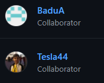
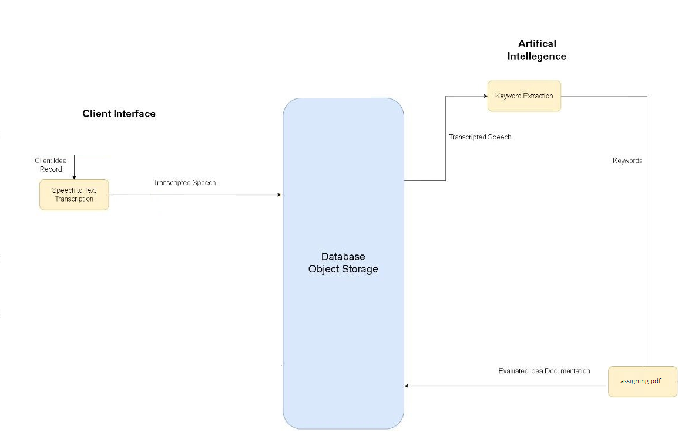

# triggerz-demo
>### NON-COMMERICAL USE PROJECT!
# Developers

> ### Project collabrators 
* Batu Alp Ustagül - API , S3 Operations  
* Ertuğrul Tunç - Transcribe Module
* Ege Ercan - Comprehend Module , Assign PDF Module , OOP 

# Requirements

Python 3.10 or newer 

py modules
- boto3 
- pandas
- pypdf2
- reportlab
## Usage

```bash
pip install -r requirements.txt
python test.py
```

### What's inside the project ?

> ### Chartflow of program

